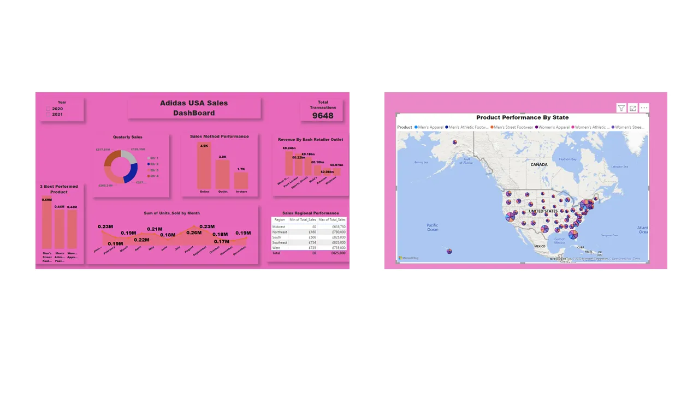

Data Analysis Project With SQL Server And Power BI

Analysis of Adidas USA Sales Dataset

Data Source: Data.world

When we communicate with data in its language, it talks back to us by revealing useful insights that can drive any sector positively. Structured Query Language (SQL) is a standard language used for managing relational databases. The collection, transformation, and organization of data to draw conclusions, make predictions for the future, and make informed data-driven decisions is called Data Analysis. The profession that handles data analysis is called a Data Analyst. These are the six steps I followed to achieve this project

Ask or Specify Data Requirements
Prepare or Collect Data
Clean and Process
Analyze
Share
Act or Report

Ask or Specify Data Requirements
This is always the first step, you look at the problem/business task. you have to understand the difficulties and the expectations of your stakeholder for you to be able to come up with the solution. The analyst must be able to ask different questions in order to fully understand the problem and root cause of the problem.

2. Prepare
The second step is to Prepare or Collect the Data. This step includes collecting data and storing it for further analysis. The analyst has to collect the data based on the task given. Since it is self sponsor project, I got my dataset from Data.word.com

3. Clean and Process Data
The third step is Process. After the data is collected , it is time to clean the data. Clean data means data that is free from misspellings, redundancies, and irrelevance. Clean data largely depends on data integrity. There might be duplicate data or the data might not be in a format, therefore the unnecessary data is removed and cleaned. There are different functions provided by SQL to achieved the above mentioned.

First I created the table ‘DataSales_Adidas$’ in Sql server, this enable me to determine the data type and to remove unwanted columns, the space in the column fields from the original dataset : the proces is in the main file

4. Analyze
The fourth step is to Analyze the data. The cleaned data is used for analyzing and identifying trends. It also performs calculations and combines data for better results. SQL is the tool I used to perform all the calculations in this project, all I need do is write a simple code and SQL provide me the answer that I seek:all code is in the main file

Key Performance Indicators Used:

What is the Total number of Transaction made?

What is revenue generated by each Retailer Outlet?

What is Sales Regional Performance ?

How did Different products Performed?

Best three Performed Products

Performance by city

Sorted the product based on the total Units purchase

Sales Method performance

What is the total purchasing of each product line in every Month?

What is the total purchasing of each product line in every Year?

Sort States and the Year where Units_sold is 65,000 and above

Sort State by Revenue generated

5. Share
The fifth step is Share. this is a s pectoral representation of your data into visual. Visualizations are made for a simple understanding of complex data, that are non-technical person by visualization can understand in a go the story the data is telling

6. Act or Report
This is where you report your finding base on the insight from the data. However, Analysis of Adidas USA Sales Dataset, provides the following Insights:
Qtr 3 had the highest Sum of Total_Sales at £265,308,354, followed by Qtr 2, Qtr 4, and Qtr 1. Qtr 3 accounted for 29.48% of Sum of Total_Sales. At 593320, Men’s Street Footwear had the highest Sum of Quntity_Sold and was 36.76% higher than Women’s Apparel, which had the lowest Sum of Quntity_Sold at 433827. Men’s Street Footwear had 593320 Sum of Quntity_Sold, Men’s Athletic Footwear had 435526, and Women’s Apparel had 433827.

Men’s Street Footwear had the highest Sum of Quntity_Sold, thus it is the best performing product for the two years which the data covers; August was the best performing month, there was a significant increase by 3% for August 2020 and 2021.

There are more Online adidas customer in 2020, At 530, Online had the highest Count of Sales_Method and is 84.67% higher than In-store, which had the lowest Count of Sales_Method at 287. Online had the highest Count of Sales_Method at 530, followed by Outlet at 485 and In-store at 287.

In 2021 the performance of online customers from previous year is 89% At 4,359, Online had the highest Count of Sales_Method and is200.00% higher than In-store, which had the lowest Count of Sales_Method at 1,453. Online had the highest Count of Sales_Method at 4,359, followed by Outlet at 2,534 and In-store at 1,453.

At £177,217,915, Foot Locker had the highest Sum of Total_Sales and was 325.25% higher than Walmart, which had the lowest Sum of Total_Sales at £41,673,410. Foot Locker accounted for 24.69% of Sum of Total_Sales. Across all 6 Retailer, Sum of Total_Sales ranged from £41,673,410 to £177,217,915.

This was my first independent project, I would appreciate any feedback that can help improve my data analysis techniques in the future.

Thank you!